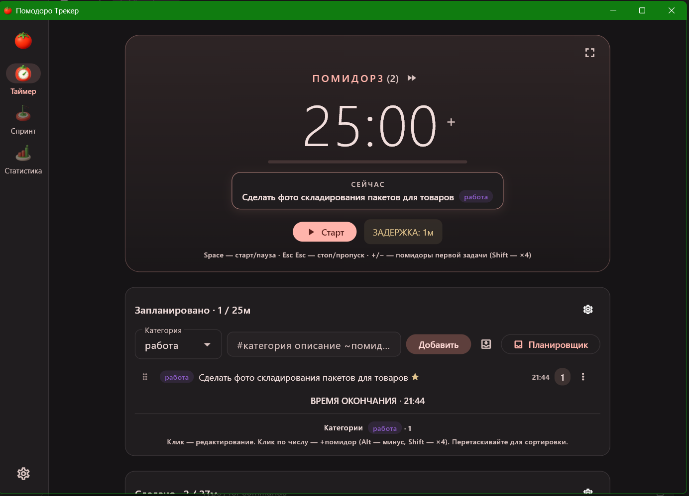

<div align="center">


# Помодоро Трекер

**Pomodoro-таймер и задачник для Windows и Android, дружащий с Obsidian.**

Таймер по технике Pomodoro с точной моделью серий, простоев и фокуса, экран
задач со сворачиваемыми группами — плюс система фокуса (лягушка дня, задачи
спринта, Flowtime). Задачи, история помидоров и спринты синхронизируются
между устройствами через твой Google Drive и зеркалятся в Obsidian-валт
обычными `.md`-файлами для чтения, поиска и git.

[English README](README.en.md)

[](LICENSE)
[](https://flutter.dev)
[](#быстрый-старт)
[](#хранение-данных)
[](#тесты)



</div>

Ни аккаунтов сервиса, ни телеметрии, ни чужих серверов: облако — только твой
собственный Google Drive, и только если ты сам его подключишь. Без синка
приложение полностью локальное.

## Почему

Обычные таймеры держат историю в чужой базе. Здесь помидоры, задачи и спринты
лежат у тебя: рабочий файл — в папке приложения, а его читаемое зеркало —
markdown в твоём валте, который видно в графе Obsidian, по которому работает
поиск и который можно класть в git. Синхронизация — через личный Drive, а не
через сервис-посредник.

---

## Содержание

- [Быстрый старт](#быстрый-старт)
- [Основные понятия](#основные-понятия)
- [Экраны](#экраны)
- [Система фокуса](#система-фокуса)
- [Горячие клавиши](#горячие-клавиши)
- [Умный ввод задач](#умный-ввод-задач)
- [Хранение данных](#хранение-данных)
- [Синхронизация Google Drive](#синхронизация-google-drive)
- [Настройки](#настройки)
- [Точные правила поведения](#точные-правила-поведения)
- [Архитектура](#архитектура)
- [Разработка](#разработка)
- [Известные ограничения](#известные-ограничения)
- [Вклад](#вклад)
- [Лицензия](#лицензия)

---

## Быстрый старт

Готовая сборка лежит на рабочем столе: папка **`Помодоро Трекер`** (самодостаточная,
запускается без установки) и ярлык **`Помодоро Трекер.lnk`**.

Собрать самому:

```bash
flutter pub get
flutter build windows --release
# → build\windows\x64\runner\Release\pomodoro_tracker.exe

flutter build apk --release
# → build\app\outputs\flutter-apk\app-release.apk
```

При первом запуске приложение создаёт папку хранения (по умолчанию
`…\Obsidian\Помодоро`) — путь меняется в настройках.

Синхронизация между устройствами — необязательная: без неё приложение
работает полностью локально. Как включить — [ниже](#синхронизация-google-drive).

---

## Основные понятия

| Понятие | Что это |
|---|---|
| **Помидор** | Отрезок работы (по умолчанию 25 мин). Завершённый помидор пишется в журнал дня. |
| **Серия** | Сквозной счётчик помидоров подряд. Каждые N помидоров — длинный перерыв. Сгорает при долгом простое. |
| **Оценка задачи** | Хранится **в минутах**, не в чекбоксах. Помидоры = `ceil(минуты / длина помидора)`. |
| **Текущая задача** | Всегда **верхняя** в списке «Запланировано». Она же в карточке «СЕЙЧАС». |
| **Логический день** | Сутки идут **с 05:00 до 05:00**. Помидор в 00:30 попадает во вчерашний файл. |
| **Простой (задержка)** | Время, пока таймер стоит или на паузе. Копится и уходит в следующую запись помидора. |
| **Прерывание** | Пауза бегущего помидора. Штрафует фокус. |
| **Спринт** | Календарная неделя (пн–вс) с вехой и целью в помидорах. |

---

## Экраны

### Таймер

Одна страница-поток:

1. **Таймер** — крупные цифры, прогресс-бар, цветовое кодирование фазы
   (работа — томатный, перерыв — зелёный). Заголовок показывает номер помидора,
   серию `(N)` и штрихи прерываний `′′`.
2. **СЕЙЧАС** — карточка текущей задачи (WIP = 1).
3. **Запланировано** — список задач с оценкой, прогнозом времени окончания,
   счётчиками категорий.
4. **Сделано** — журнал сегодняшних помидоров с фокусом, простоями и прерываниями.

Заголовок окна во время работы показывает `MM:SS категория` — видно с панели задач.

### Задачи

Полноэкранный задачник поверх того же списка, что у таймера:

- **Quick-add сверху**: умный ввод, `Enter` — во «Входящие» (захват без
  оценивания), `Ctrl+Enter` — в «Сегодня», `Ctrl+N` — сюда из любого места
  приложения;
- **Сворачиваемые группы** со счётчиками и суммой 🍅: Сегодня / Входящие /
  Завтра / Эта неделя / Позже / Сделано за неделю (состояние запоминается);
- первая задача «Сегодня» подсвечена рамкой **СЕЙЧАС** (WIP = 1);
- приоритет = клик 🐸 / клик ⭐ / перетаскивание (drag работает и внутри
  корзин планировщика);
- удаление — со снекбаром «Отменить»;
- широкое окно (≥1000px) — два столбца, узкое — один.

### Спринт

Веха недели, ⭐-задачи спринта, «Сделано за неделю», плитки факта
(Факт / Время / Темп / Прогноз), прогресс к цели, график по дням и история недель.

### Статистика

Периоды: Сегодня / Неделя / Месяц / 365 дней / Диапазон.
Плитки: Помидоры, Время, Фокус, 🐸 Лягушки, Лучший день.
Графики: по категориям, последние 14 дней, карта активности (от 90 дней).

> Плитки «серия дней» (стрика) нет **намеренно** — рваный стрик кормит самокритику.

---

## Система фокуса

Поверх классического таймера — элементы личной системы фокуса:

| Элемент | Как работает |
|---|---|
| 🐸 **Лягушка дня** | Одна на день, всегда наверху списка. Ставится в Планировщике. **Сбрасывается каждое утро** (граница 05:00). |
| ⭐ **Задача спринта** | Обязательство недели, двигает веху. Ставится в Планировщике. **Снимается автоматически в новую неделю.** Закрытая ⭐-задача уезжает в «Сделано за неделю». |
| **СЕЙЧАС (WIP = 1)** | Одна задача в работе — верхняя в списке. |
| **Flowtime** | Помидор дотикал — таймер тихо считает вверх (`+ MM:SS`), пока не нажмёшь «Готово». Не выбивает из потока. Включается в настройках. |
| **«На чём встал?»** | При стопе бегущего помидора — вопрос одной строкой. Ответ уходит в `## Заметки` журнала дня. Можно пропустить. |
| **Подсказка при застревании** | Простой > 10 мин → «Разбей до шага на 5 минут — и стартуй». |
| **Предупреждение о перегрузе** | Больше 3 задач в дне → напоминание про «🐸 + 2 задачи». |
| **Стата лягушек** | «🐸 N / M» — дней с лягушкой из **активных** дней. Без стрика. |

**Корзины ≠ спринт.** Планировщик (Входящие / Завтра / Эта неделя / Позже) — это
**сроки**. Спринт — это только ⭐. Задача может быть во Входящих и при этом в спринте.

**Категория = проект.** Отдельной иерархии подзадач нет намеренно: большие цели
живут в Obsidian (Направления / Дерево зависимостей), а здесь — исполнение.
Группируй задачи проекта одной категорией и смотри её счётчик.

---

## Горячие клавиши

| Клавиша | Действие |
|---|---|
| `Space` | Старт / Пауза |
| `Esc` `Esc` | Стоп (или Пропустить перерыв) — **двойное нажатие**, второе в течение 1.5 с. Кнопка краснеет в ожидании. |
| `+` / `−` | Помидоры первой задачи (`Shift` — по 4) |
| `Ctrl+N` | Экран «Задачи», курсор в поле быстрого добавления — из любого места |

На экране «Задачи»: `Enter` — во «Входящие», `Ctrl+Enter` — в «Сегодня».
Клик по числу помидоров: `+1`, `Alt`-клик `−1`, `Shift` — ×4.
Хоткеи не срабатывают при открытом диалоге и в полях ввода (кроме `Ctrl+N`).

---

## Умный ввод задач

В поле описания:

```
#категория Описание задачи ~3
```

- `#категория` — в начале строки, задаёт категорию;
- `~N` или `::N` — количество помидоров (потолок 300 минут);
- без них берутся категория из дропдауна и длина помидора активной схемы.

Кнопка **📥** — сразу во «Входящие» (быстрый захват, минуя список дня).

---

## Хранение данных

**Истина — `data.json`** (на Windows `%APPDATA%\com.local\pomodoro_tracker\`,
на Android — приватный каталог приложения; атомарная запись, стабильные id у
каждой задачи и каждого помидора). Один
документ на всё: задачи, журнал, спринты и надгробия удалённых записей.
Он же целиком синхронизируется — поэтому закрытая задача и записанный
помидор всегда приезжают на другое устройство вместе.

При первом запуске данные автоматически мигрируют из того, что было:
задачи из `tasks.json`, журнал и спринты из markdown валта. Исходные файлы
не удаляются — откат возможен удалением `data.json`.

Markdown в папке хранения (по умолчанию `…\Obsidian\Помодоро`) — **зеркала
для чтения в Obsidian**:

```
Помодоро/
├── Задачи.md                    # ЗЕРКАЛО задачника
├── Входящие.md                  # инбокс: захват задач из Obsidian
├── Журнал/
│   └── 2026-07/
│       └── 2026-07-16.md        # ЗЕРКАЛО: помидоры дня + заметки
└── Спринты/
    └── 2026-W29.md              # ЗЕРКАЛО: веха, цель, факт по дням
```

### Зеркала — только чтение

`Задачи.md`, `Журнал/*.md` и `Спринты/*.md` перегенерируются при каждом
изменении: видно в Obsidian, работает поиск и git-история, это же аварийный
бэкап в человекочитаемом виде. **Правки в них не читаются и затираются**
(сверху — пометка об этом). Веху недели правь в приложении.
Выключатель зеркал — в настройках.

Единственный файл, который читается обратно, — `Входящие.md`.

```markdown
<!-- Зеркало Помодоро Трекера: правки здесь не читаются. -->
# Задачи

## Сегодня
- 🐸 Сделать оплату #проекты ⏱ 50м ⭐
- Код-ревью PR 42 #работа ⏱ 25м

## Планировщик
- Посмотреть пример держателя #работа ⏱ 30м 📅 2026-07-18
```

- `🐸` — префикс лягушки дня; `⭐` — суффикс задачи спринта;
- `⏱ 50м` — оценка в минутах; `📅 2026-07-18` — срок (вкладка планировщика
  вычисляется из даты, **просроченное автоматически показывается во «Входящих»**).

### Входящие.md — захват из Obsidian

Пишешь строки в любом виде (`- купить домен ~1 #прочее`, можно с чекбоксами
и маркерами) — приложение при запуске и при фокусе окна забирает их во
«Входящие» через умный парсер и возвращает файл к шаблону. Направление
строго одно: файл → приложение, конфликтов нет. Так задачи добавляются из
Obsidian и с телефона (файл синхронизируется Google Drive).

### Журнал/YYYY-MM/YYYY-MM-DD.md

```markdown
---
дата: 2026-07-16
помидоры: 3
минуты: 75
простой: 7
прерывания: 2
фокус: 92%
цель: 8
---

# 16.07.2026 · 3 🍅 · 1ч 15м · фокус 92%

| Начало | Мин | Простой | Прерывания | Категория | Задача | Как |
| ------ | --- | ------- | ---------- | --------- | ------ | --- |
| 09:12 | 25 | 0 | 0 | работа | 🐸 Код-ревью | таймер |
| 10:05 | 25 | 7 | 2 | личное | Английский | вручную |

## Заметки
- 14:30 — встал на верстке карточки, не сходится отступ
```

- `🐸` в задаче = помидор над лягушкой (для статы);
- `таймер` / `вручную` — отработано или отмечено руками;
- часы `00:00–04:59` относятся к следующей календарной дате (логический день).

### Спринты/YYYY-Wnn.md

Frontmatter (`спринт`, `начало`, `конец`, `цель`, `веха`, `факт`, `минуты`),
снапшот `## Задачи недели`, `## Сделано за неделю`, таблица `## По дням`.

Факт по дням в `data.json` не хранится — он считается из журнала. Поэтому
помидоры не заставляют спринт отправляться в Drive: файл уходит только при
реальной правке цели, вехи или списка сделанного.

### Настройки приложения

JSON, **не** в валте: `%APPDATA%\com.local\pomodoro_tracker\settings.json`
(имя папки задаётся `CompanyName` в `windows/runner/Runner.rc`; менять его
нельзя — данные окажутся в другом каталоге).
Настройки локальны для устройства и не синхронизируются — там же лежат
ключи OAuth. Рядом `data.json` (все данные) и `timer_state.json` —
состояние таймера для восстановления после перезапуска.

---

## Синхронизация Google Drive

`data.json` целиком — задачи, журнал и спринты — синхронизируется между
устройствами через **скрытую папку приложения** (appDataFolder) на твоём
Google Drive: файл не виден ни тебе в интерфейсе Drive, ни другим
приложениям. Настройки остаются локальными на каждом устройстве.

**Как работает:**

- при старте, при возврате в окно/приложение (не чаще раза в минуту) и через
  5 секунд после любой правки — автоматический синк;
- файл сравнивается по ревизии Drive: менялся только он — забираем; менялись
  только мы — отправляем;
- **конфликт** (менялись оба устройства) разрешается **слиянием, а не выбором
  победителя**: списки объединяются по id, ни одна задача и ни один помидор
  не пропадают. Более свежая сторона решает только судьбу спорных скаляров —
  цели дня и вехи недели. Проигравшая версия дополнительно сохраняется рядом
  в `data_conflict.json`;
- **первое подключение** устройства с непустым Drive — то же слияние:
  не затирается ничего ни там, ни тут.

### Удаления и надгробия

Просто «более короткий файл» не отличить от «данные ещё не приехали» —
поэтому удаления записываются явно. При каждой записи репозиторий сравнивает
набор id до и после: исчезнувшие попадают в список надгробий с датой и едут
вместе с данными. Слияние вычитает похороненные id из всех списков.

- удаление побеждает **безусловно**: если запись удалили на одном устройстве
  и отредактировали на другом, она остаётся удалённой. Судьбу записи не решают
  часы устройств — иначе расхождение времени между Android и Windows вернуло
  бы недетерминированность;
- надгробия ставятся диффом при записи файла, а не в местах удаления: это
  разом покрывает все пути — «минус» в ноль, «Очистить список», удаление
  записи журнала, слияние задач;
- возврат записи (восстановление из корзины) снимает надгробие;
- надгробия старше 90 дней вычищаются: к этому моменту удаление доехало
  до всех устройств.

### Настройка Google Cloud (один раз)

1. [console.cloud.google.com](https://console.cloud.google.com) → создать
   проект (любое имя).
2. **APIs & Services → Library** → включить **Google Drive API**.
3. **APIs & Services → OAuth consent screen** → External → заполнить имя и
   почту → добавить себя в **Test users** (публикация не нужна).
4. **Credentials → Create credentials → OAuth client ID:**
   - **Desktop app** — для Windows. Получишь Client ID + Client Secret →
     вставить в Настройки → Приложение → Google Drive → «Подключить»;
   - для Android дополнительно:
     - **Android** — package `com.zfannur.pomodoro_tracker` + SHA-1 того
       ключа, которым подписан APK (`cd android && ./gradlew signingReport`,
       строка `Variant: release`). Значения этого клиента в приложение
       вводить не нужно — он существует, чтобы Google опознал приложение;
     - **Web application** — его Client ID вставить в поле
       «Server Client ID (Web)» в настройках приложения на телефоне.

Все три клиента должны лежать **в одном проекте** с включённым Drive API.

Scope только `drive.appdata` — приложение не видит остальные файлы Drive.
Client Secret Desktop-клиента по политике Google для установленных приложений
секретом не считается; храним его в локальном `settings.json`.

**Если вход падает с `DEVELOPER_ERROR`** — Google не нашёл клиента под это
приложение: чаще всего в Android-клиенте указан SHA-1 другого ключа (например
debug вместо релизного) или клиенты разложены по разным проектам.

---

## Настройки

### Таймер

- **Схемы** (до 6): `classic` 25/5/15×4, `work` 50/10/20×2, `personal` 30/2/25×4 —
  длительности редактируются, схемы добавляются;
- автостарт помидора после перерыва / перерыва после помидора / только при наличии задач;
- **Flowtime**;
- цель на день (0 — без цели), цель спринта по умолчанию (40).

### Оповещения

- громкость, финишный звук (10 мелодий: bell, beep, chime, cuckoo, guitar,
  maramba, organ, rise, satellite, school), тиканье (опционально и в перерывах);
- системные уведомления, предупреждение за минуту до конца, поднятие окна;
- **кастомные тексты** уведомлений — по строке на вариант, выбирается случайный;
- **Telegram** — дублирование уведомлений через своего бота (токен + chat id).

### Приложение

- тема: Светлая / Тёмная / Системная / **Авто** (светлая 07:00–18:59) /
  **Матрица** (чёрный фон, неоновый зелёный, моноширинный шрифт);
- **язык интерфейса** — Русский / English, переключается мгновенно, без
  перезапуска;
- формат даты (6 вариантов) и времени (24ч / 12ч);
- папка хранения и **зеркалирование задач в валт** (`Задачи.md`);
- категории и **привязка схемы к категории** (задача в категории получает
  свою длину помидора при оценке). Новую категорию можно вписать прямо в
  диалоге редактирования задачи — она сразу появится во всех списках;
- **Google Drive** — подключение синхронизации задач
  (см. [раздел выше](#синхронизация-google-drive)).

Названия категорий и данные в markdown-файлах (валт) всегда на том языке,
на котором их ввёл пользователь — язык интерфейса влияет только на текст
самого приложения.

---

## Точные правила поведения

Ключевые правила, определяющие поведение таймера и журнала:

- **Фокус** = `0` при пустом дне; иначе `base = 1 − простой / (2 × минуты)`
  (`0.5` при нулевых минутах); при прерываниях
  `base = min(base, 0.99) ^ ((помидоры + прерывания) / помидоры)`; результат 0..100.
- **Простой** копится, пока таймер стоит/на паузе, и уходит в **следующую** запись,
  ограниченный длиной помидора. У **первой записи дня** простой всегда `0`.
- **Серия сгорает**, если простой перед стартом дольше длинного перерыва.
  Длинный перерыв обнуляет серию.
- **Анти-накрутка**: запись от таймера не длиннее, чем прошло минут с прошлой записи.
- **Прогноз времени окончания** учитывает перерывы и тип перерыва по счётчику серии.
- **Восстановление**: состояние таймера переживает перезапуск, если прошло **< 1 часа**.
- **Смена дня** ловится на лету (проверка раз в минуту): список «Сделано»
  начинается заново, 🐸 сбрасывается, при смене недели снимаются ⭐.
- **Один экземпляр на систему**: повторный запуск поднимает уже открытое
  окно и выходит (два процесса молча перезаписывали бы данные друг друга).

---

## Архитектура

Flutter 3.44 / Dart 3.12, Windows desktop + Android. Слои:

```
lib/
├── app/            # strings.dart (все тексты, ru/en), theme.dart (все цвета)
├── core/           # failure.dart
├── domain/
│   ├── entities/   # PomoTask, PomoSession, DayLog, Sprint, AppSettings
│   └── repositories.dart
├── data/
│   ├── markdown_codec.dart       # чистые сериализация/парсинг (покрыт тестами)
│   ├── data_merge.dart           # слияние двух снимков data.json (чистая функция)
│   ├── json_data_repository.dart # data.json: истина, миграция, надгробия, зеркала
│   ├── vault_repositories.dart   # доступ к валту, инбокс, настройки
│   └── timer_state_store.dart
├── presentation/
│   ├── cubits/     # timer, tasks, journal, sprint, stats, settings, sync
│   ├── screens/    # timer, tasks, sprint, stats, planner_dialog, settings_dialog
│   ├── widgets/    # common.dart
│   └── home_shell.dart
├── services/       # sound_service (звуки синтезируются в WAV), notify_service,
│                   # sync_auth (OAuth по платформам), drive_sync_service
└── main.dart       # сборка зависимостей, rollover 🐸/⭐
```

- **Состояние**: Cubit (`flutter_bloc`), состояния на `Equatable`.
- **Ошибки**: `Either<Failure, T>` (`fpdart`) на границе репозиториев.
- **Цвета** — только в `theme.dart`, **тексты** — только в `strings.dart`.
- **Запись файлов атомарная** (temp + rename), чтобы Obsidian/Drive не видели полфайла.
  У репозитория и у синка **разные** временные имена: на общем уже ловили
  склейку контента и битый JSON.
- **`JsonDataRepository` реализует три интерфейса сразу** (задачи, журнал,
  спринты): они читают один документ, и состояние в памяти обязано быть одно.
  Поэтому же методы называются `saveTasks`/`saveSprint`, а не `save`.
- **Слияние вынесено в чистую функцию без IO** — самая неприятная часть
  синхронизации проверяется тестами, а не руками на двух устройствах.
- **Записывает пришедшее с Drive сам репозиторий** (`applyRemote`), а не синк:
  иначе документ в памяти разошёлся бы с диском, и следующая правка похоронила
  бы всё, что только что приехало.

---

## Разработка

```bash
flutter pub get
flutter analyze          # должно быть чисто
flutter test             # 104 теста
flutter run -d windows   # дебаг
flutter build windows --release
flutter build apk --release
```

### Android

Ключ подписи задаётся в `android/key.properties` (в гит не попадает).
Отпечаток именно этого ключа регистрируется в Google Cloud — **со сменой
ключа вход Google перестаёт работать**:

```bash
cd android && ./gradlew signingReport   # SHA-1 для Cloud Console
```

### Иконка приложения

```bash
# assets/icon/logo.png (квадрат, прозрачный фон, с полями)
python tool/make_icon.py     # → .ico для Windows + mipmap-*/ic_launcher.png
flutter build windows --release
```

Многоразмерный `.ico` обязателен: с одним 256px Windows грубо ужимает иконку
до 24px в панели задач. После смены иконки может понадобиться чистка кэша
иконок Windows (`IconCache.db` + перезапуск Explorer).

### Тесты

- `test/markdown_codec_test.dart` — round-trip задач, журнала (🐸, `|`, ночные
  помидоры), спринта; формула фокуса; логическая дата; ISO-недели.
- `test/timer_cubit_test.dart` — цикл помидор/перерыв, серия, пауза и прерывания,
  стоп, пропуск, продление, умный ввод.
- `test/stats_frog_test.dart` — подсчёт дней с лягушкой.
- `test/strings_test.dart` — переключение языка интерфейса, локализованные
  единицы времени.
- `test/json_data_repository_test.dart` — миграция задач и журнала, round-trip,
  повторяемость id при миграции, надгробия, синтез пустых дней, зеркала,
  файл-инбокс, `applyRemote`.
- `test/data_merge_test.dart` — слияние: объединение по id, delete-wins в обе
  стороны, сохранность незнакомых секций, идемпотентность.
- `test/tasks_cubit_planner_test.dart` — сортировка в корзинах, редактирование,
  корзина удалённых, сериализация записи на диск.
- `test/drive_sync_test.dart` — алгоритм Drive-синка: push/pull, слияние при
  первом подключении и при конфликте, живучесть dirty-флага, вход ровно один раз.
- `test/sync_auth_test.dart` — что решается до инициализации Google-входа
  (её нельзя выполнить дважды за запуск).
- `test/stats_screen_test.dart` — экран статистики строится на телефонной и на
  широкой ширине (раскладка уже ломала экран целиком).

---

## Известные ограничения

- **Markdown — только зеркала**: правки в `Задачи.md`, `Журнал/*.md` и
  `Спринты/*.md` не читаются и затираются при следующей записи. Добавлять
  задачи из Obsidian — через `Входящие.md`; всё остальное — в приложении.
- **Flowtime-овертайм не переживает перезапуск** — при закрытии в овертайме
  помидор теряется.
- **Android**: уведомлений нет, таймер живёт пока приложение открыто
  (фоновый сервис не заводился намеренно). Папка хранения фиксирована —
  выбор каталога дал бы `content://`-адрес, а не путь.
- **Заметки дня и «Сделано за неделю» сливаются по тексту**, а не по id:
  две дословно одинаковые строки, добавленные на разных устройствах,
  схлопнутся в одну. У них нет удаления в интерфейсе, поэтому давать им
  идентификаторы не стали.
- **`data.json` растёт** — примерно на треть мегабайта в год при десяти
  помидорах ежедневно, и целиком отправляется при каждом синке. Когда
  начнёт мешать, дешёвый выход — сжатие или вынос старых лет в отдельный
  несинхронизируемый файл. Шардинг сейчас был бы ставкой на будущее,
  которого может не быть.
- **Смена ключа подписи Android ломает вход Google**: в Cloud Console
  зарегистрирован отпечаток конкретного ключа.
- Сознательно без серверных фич: аккаунтов, лидерборда, шаринга,
  интеграций (Slack/Trello/Todoist, кроме Google Drive-синка), почтовых
  отчётов, повторяющихся задач — это локальный инструмент, а не SaaS-платформа.

---

## Вклад

Проект личный, но PR и issue приветствуются.

Перед PR:

```bash
flutter analyze   # должно быть чисто
flutter test      # все тесты зелёные
dart format lib test
```

Правила кодовой базы:

- **цвета** — только в `lib/app/theme.dart`, **тексты** — только в `lib/app/strings.dart`;
- репозитории возвращают `Either<Failure, T>`, слои `domain` / `data` / `presentation` не смешиваются;
- логика парсинга markdown — в `markdown_codec.dart` (чистые функции) и покрывается тестом;
- любые таймеры отменяются в `close()` / `dispose()`;
- осознанные упрощения помечаются комментарием `// ponytail:` с указанием потолка решения.

Изменения в базовых правилах поведения (формула фокуса, простои,
серии, логический день) — только с тестом.

## Лицензия

[MIT](LICENSE) © zFannur

«Pomodoro Technique» — торговая марка Francesco Cirillo; проект не аффилирован
с автором техники и не является официальной реализацией.
